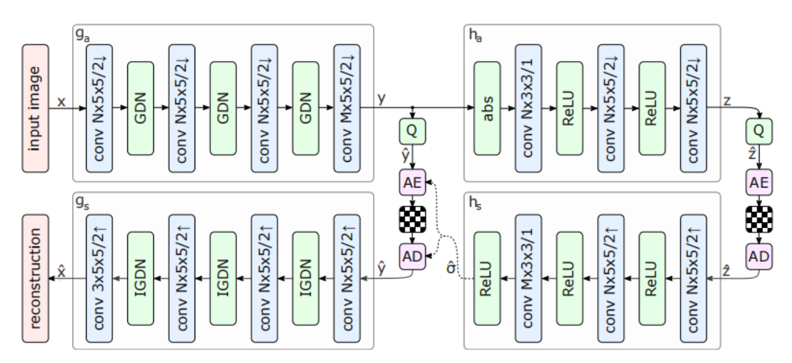

以 https://arxiv.org/abs/1802.01436 论文为为基础，在compressai中为`bmshj2018-hyperprior`

### 转模型

1. 需要修改的模块

   - `compressai/models/google.py`

   - `compressai/utils/eval_model/__main__.py`

2. 文档

   1. `normal.md`
   2. `refactor_module.md`

### 熵编码