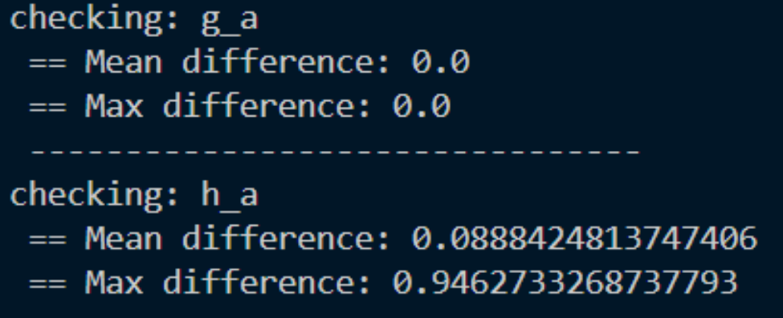

1. 对精度

   ```python
       def _check_onnx_model_accuracy(self, model_name, input_name, input_data, output_data, check_path, onnx_path):
           print(f"checking: {model_name}")
           if not os.path.exists(check_path):
               os.makedirs(check_path)
           input_check_path = os.path.join(check_path, f'{model_name}_input.pt')
           output_check_path = os.path.join(check_path, f'{model_name}_output.pt')
           onnx_path = os.path.join(onnx_path, f'{model_name}.onnx')
   
           torch.save(input_data, input_check_path) 
           torch.save(output_data, output_check_path) 
   
           sess = onnxruntime.InferenceSession(onnx_path, providers=['CUDAExecutionProvider', 'CPUExecutionProvider'])
           input_onnx = input_data.numpy()
           output_onnx = sess.run(None, {input_name: input_onnx})[0]
   
           diff = np.abs(output_data.numpy() - output_onnx)
           print(f' == Mean difference: {np.mean(diff)}')
           print(f' == Max difference: {np.max(diff)}')
           print(' -------------------------------- ')
   ```

2. 由于pytorch和onnx的精度本身存在不同，所以细节的差距可以忽略不计

   ```
   onnx是fp16  torch是32
   ```

   

3. 在这个示例中`h_a`的精度存在问题，但是`g_s`并没有

   ​    这个精度的损失是无法接受的，我们可以通过查找发现z_hat进行的不只是round的量化，而是一个包含means的操作：

   ```python
   # entropy_models/entropy_models.py/EntropyBottleneck/forward
   outputs = self.quantize(
           values, "noise" if training else "dequantize", self._get_medians()
   )
   
   # entropy_models/entropy_models.py/EntropyBottleneck
   def _get_medians(self) -> Tensor:
       medians = self.quantiles[:, :, 1:2]
       return medians
       
   self.quantiles = nn.Parameter(torch.Tensor(channels, 1, 3))
   
   # entropy_models/entropy_models.py/EntropyModel/quantize
   def quantize(
       self, inputs: Tensor, mode: str, means: Optional[Tensor] = None
   ) -> Tensor:
       if mode not in ("noise", "dequantize", "symbols"):
           raise ValueError(f'Invalid quantization mode: "{mode}"')
   
       if mode == "noise":
           half = float(0.5)
           noise = torch.empty_like(inputs).uniform_(-half, half)
           inputs = inputs + noise
           return inputs
   
       outputs = inputs.clone()
       if means is not None:
           outputs -= means
   
       outputs = torch.round(outputs)
   
       if mode == "dequantize":
           if means is not None:
               outputs += means
           return outputs
   
       assert mode == "symbols", mode
       outputs = outputs.int()
       return outputs
   ```

   ​    其中`self.quantiles`已经被保存在了模型的参数中，所以需要用`torch.load`进行加载和获取；

   ​    最后重构的结果是：

   ```python
       def _convert_z_encoder(self, model_name, input_shapes, output_path):
           class Encoder(nn.Module):
               def __init__(self, h_a):
                   super(Encoder, self).__init__()
                   self.h_a = h_a
                   root_url = "https://compressai.s3.amazonaws.com/models/v1"
                   model_url = f"{root_url}/bmshj2018-hyperprior-1-7eb97409.pth.tar"
                   state_dict = torch.hub.load_state_dict_from_url(model_url)
                   self.quantiles = state_dict['entropy_bottleneck.quantiles']
   
               def forward(self, z):
                   z = self.h_a(z)
                   z_hat = self.dequantize(z, self._get_medians())
                   return z_hat
               
               def dequantize(self, inputs, means):
                   mode = "dequantize"
                   outputs = inputs.clone()
                   if means is not None:
                       outputs -= means
                   outputs = torch.round(outputs)
                   if means is not None:
                       outputs += means
                   return outputs
   
               def _get_medians(self):
                   medians = self.quantiles[:, :, 1:2]
                   return medians
   
           new_mode = Encoder(self.h_a)
           self._convert(new_mode, model_name, ['y_input'], input_shapes, ['z_hat_output'], output_path)
   ```

   修改后的模型精度能够很好的对齐

   

