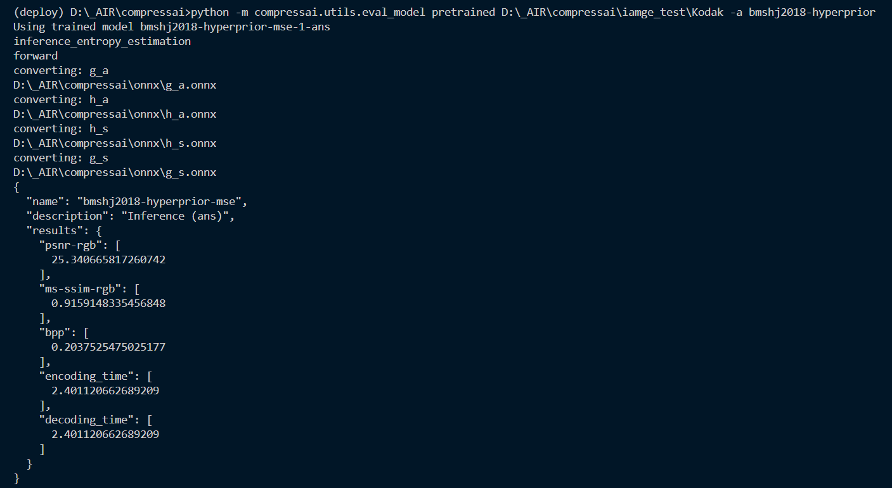

1. 修改eval_model模式下的调用内容

   ​    通过改为调用`inference_entropy_estimation`从而只需跑一遍`forward`进行转模型

   

2. 转模型

   ​    在模型class中添加`_convert`转模型函数，在需要转模型的位置添加函数调用

   ```python
   def _convert(self, model, model_name, input_names, input_shapes, output_names, output_path):
               print(f"converting: {model_name}")
               dummy_inputs = torch.randn((1, *input_shapes))
               model_path = os.path.join(output_path, f"{model_name}.onnx")
               print(model_path)
               dynamic_axes = {name: {0: "batch", 2: "height", 3: "width"} for name in input_names}
               dynamic_axes.update({name: {0: "batch", 1: "height", 2: "width"} for name in output_names})
               torch.onnx.export(
                   model=model, args=tuple(dummy_inputs), f=model_path,
                   input_names=input_names, dynamic_axes=dynamic_axes,
                   output_names=output_names, opset_version=11)
   ```

   ```python
   # 调用示例
   onnx_path = 'D:\_AIR\compressai\onnx'
   self._convert(self.g_a, "g_a", ['x_input'], x.shape, ['y_output'], onnx_path)
   ```

   

3. 命令

   ```shell
   python -m compressai.utils.eval_model pretrained D:\_AIR\compressai\iamge_test\Kodak -a bmshj2018-hyperprior
   ```

   

