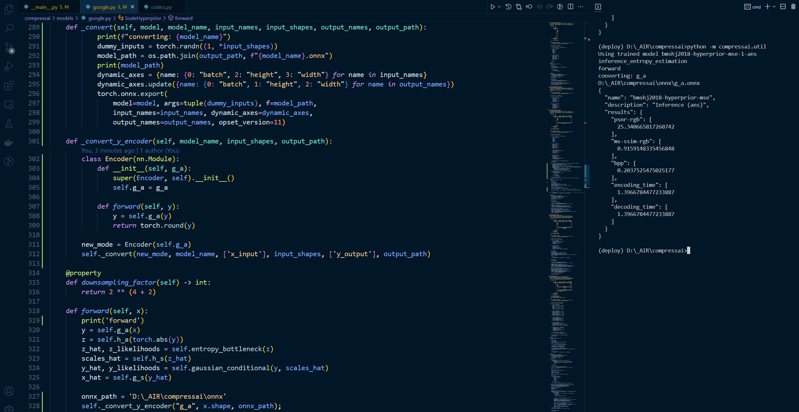

1. 重构模型

   ```python
       def _convert_y_encoder(self, model_name, input_shapes, output_path):
           class Encoder(nn.Module):
               def __init__(self, g_a):
                   super(Encoder, self).__init__()
                   self.g_a = g_a
   
               def forward(self, y):
                   y = self.g_a(y)
                   return torch.round(y)
   
           new_mode = Encoder(self.g_a)
           self._convert(new_mode, model_name, ['x_input'], input_shapes, ['y_output'], output_path)
   ```

2. 调用

   ```python
   onnx_path = 'D:\_AIR\compressai\onnx'
   self._convert_y_encoder("g_a", x.shape, onnx_path);
   ```

3. 命令

   ```shell
   python -m compressai.utils.eval_model pretrained D:\_AIR\compressai\iamge_test\Kodak -a bmshj2018-hyperprior
   ```

