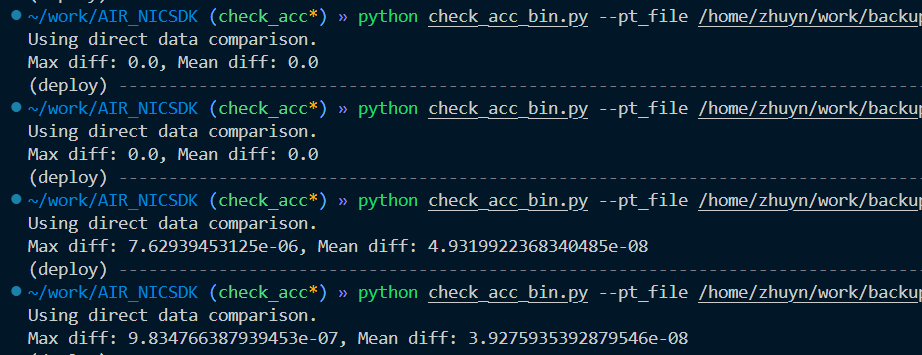

1. 将`pytorch`中导出的`.pt`文件转为`.bin`格式，便于模型的读入

   ```shell
   python pt2bin.py --input ${pt_path} --output ${onnx_path}
   ```

2. 运行推理

3. 比对`pytorch`中导出的`.pth`文件与`onnx`推理后输出的`.bin`文件

   ```shell
   python check_acc_bin.py --pt_file ${pt_path} --bin_file ${bin_path}
   ```

   

