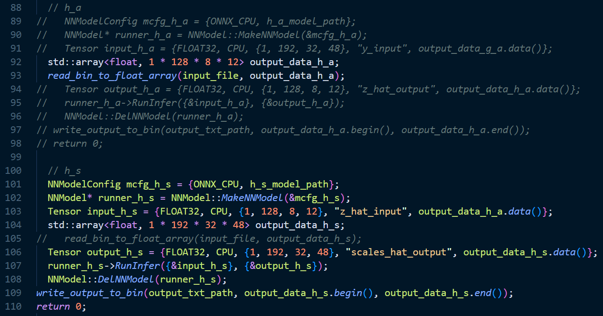
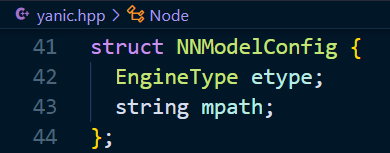
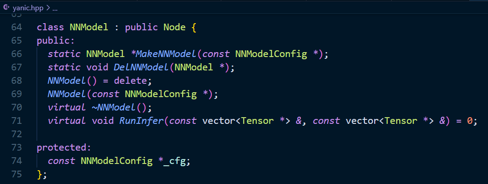
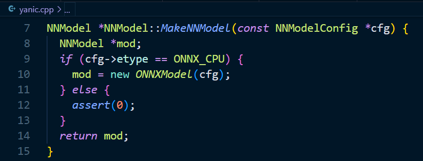
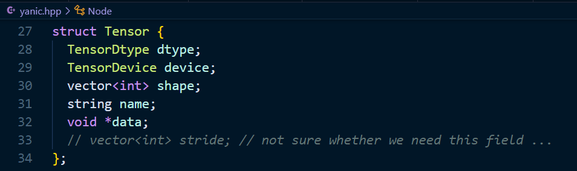
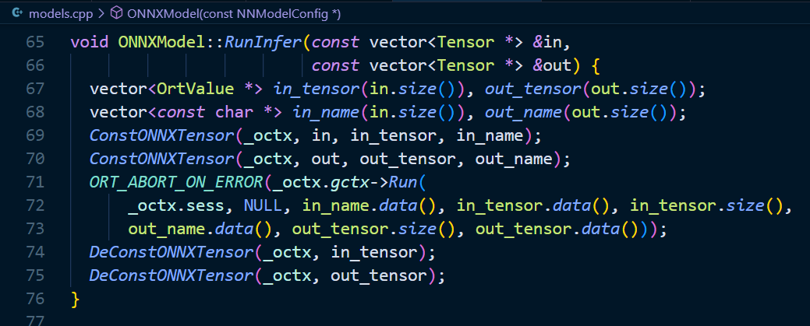
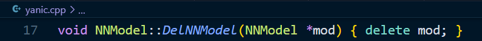

Demo: 



​	对于上图格式，执行推理的代码应对应为

```shell
./test ${onnx_path} ${h_s_input_path} ${h_s_output_path}
```

****

1. 定义模型对象

   ```c++
   NNModelConfig mcfg_h_s = {ONNX_CPU, h_s_model_path};
   ```

   

2. 创建模型实例

   ```c++
   NNModel* runner_h_s = NNModel::MakeNNModel(&mcfg_h_s);
   ```

   

   

3. 创建输入和输出

   ```c++
   std::array<float, 1 * 128 * 8 * 12> output_data_h_a;
   read_bin_to_float_array(input_file, output_data_h_a);
   Tensor input_h_s = {FLOAT32, CPU, {1, 128, 8, 12}, "z_hat_input", output_data_h_a.data()};
   
   std::array<float, 1 * 192 * 32 * 48> output_data_h_s;
   Tensor output_h_s = {FLOAT32, CPU, {1, 192, 32, 48}, "scales_hat_output", output_data_h_s.data()};
   ```

   

4. 进行推理

   ```c++
   runner_h_s->RunInfer({&input_h_s}, {&output_h_s});
   ```

   

5. 释放实例

   ```c++
   NNModel::DelNNModel(runner_h_s);
   ```

   

